# CHATAFL

### 文章概要

本文主要工作：

- 实现了一个LLM引导的协议模糊器。通过询问LLM来实现动态状态推断，以更深入地覆盖协议软件。
- 提出三种基于LLM的模糊器变异策略，每种策略解决了协议模糊测试的特定挑战。本文实现了灰盒模糊测试算法并命名为CHATAFL。目前该工具已在github开源。
- 本中实验结果表明，CHATAFL在协议状态空间和覆盖率要比AFLNET和NSFUZZ更加有效。还发现了9个未知漏洞。

现有协议模糊测试的Challenges：

- C1：依赖初始种子文件
- C2：未知的协议数据包结构
- C3：未知的状态空间

### Case Study

- 用例：Live555 （RTSP），实现标准：RFC 2326

- 基准：Profuzzbench

- LLM：ChatGPT 3.5

#### A. 提高消息语法：质量和多样性

首先，需要构造一套标准（ground-truth）语法，作者对RFC2326协议标准研读，人工提取对应的语法。最终提取了10中RTSP特定的客户端请求的真实语法。每种请求由2到5个头部组成。如图3所示，PLAY的语法由4个头部组成。并且某些请求具有特定的头部字段。

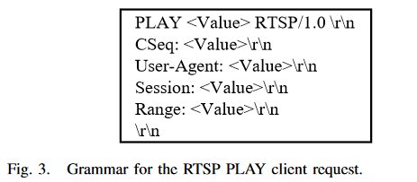

从LLM中随机抽取50个RTSP协议答案来合并为一个答案集。如图4所示，LLM为10种消息类型生成语法。预计这些消息类型会出现在LLM的40多个答案中。还验证了LLM生成语法的质量，其中10中消息类型中的9种于RFC中提取的真实语法相同，其中1种是在PLAY中忽略了一些可选字段，如`range`。进一步检查PLAY语法，其中35个答案中准求生成了包含`range`语法，另外15个忽略`range`字段。以上可认为LLM能生成高精度的消息语法能力，可用于指导变异算法。

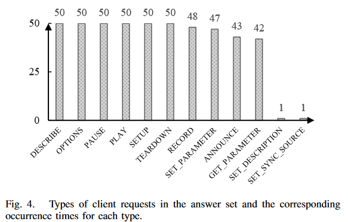

**结论：**LLM 为所有类型的 RTSP 客户端请求的结构生成与标准协议相匹配的消息，尽管存在一定的随机性。

#### B、增强种子语料：多样性和有效性

使用LLM将随机的消息添加到给定消息序列中，并评估多样性和有效性。profuzzbench中的RTSP预料仅包含4种消息请求，缺少了其他6种请求，会导致RTSP绝大多数状态未被探索。但是传统变异生成这6种请求概率较低，作者通过观察AFLNET和NSFUZZ产生的 测试用例，均未发现新的请求类型。因此初始种子集合是重要的。

作者通过LLM来为每种请求类型来生成10条消息，共100条客户端请求。然后验证生成的消息序列是否满足RTSP的状态机请求顺序，若是准确的就将其发送到待测服务器。其结果表明99%的请求都是满足状态记顺序的。这些请求大约55%可以被服务器直接接受，相应代码为2xx。不接受的消息是因为Live555不接受协议标准中的一些功能，还有就是会话ID不准确，需要调整正确的会话ID。

作者开发了两种结合方式：

1、将服务器响应包含在prompt中，然后请求LLM生成相同类型的消息。这样产生的消息可以直接被服务器接受。

2、尝试将会话ID包含到给定的请求序列中，然后LLM也准确地将相同的值插入到这些消息并生成正确的结果。

**结论：**LLM可以有效的生成正确的消息并能够丰富初始种子集。

#### C、包含Interesting的状态转移

为LLM提供模糊器和服务器之间的消息交换，要求它返回一条会导致新状态的消息。作者评估了引起新状态转移的可能性。具体做法是为LLM提供现有的通信历史记录，使服务器能够分别到达每个状态，然后查询LLM以确定下一个可能影响服务器状态的请求。

图5展示了每个状态的结果，灰色表示导致状态转移的消息百分比，橙色表示适当状态但不导致状态转移的消息，蓝色表示直接被服务器拒绝的不正确状态的消息。

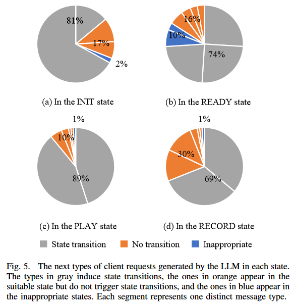

**结论：**LLM生成的客户端请求，69%~89%可以引发状态转移，并覆盖了每个状态的所有状态转移。

### LLM指导的协议模糊测试

本节介绍的LLMPF方法，通过合并算法一中的灰色组件来增强传统EMPF：

（1）通过提示LLM提取语法（第2行），并利用语法来指导模糊突变（第12-14行）（第IV-A节）;

（2）查询LLM以丰富初始种子集（第3行）（第IV-B节）;

（3）利用LLM的能力突破覆盖瓶颈（第4、19-21、26、30和32行）（第IV-C节）。

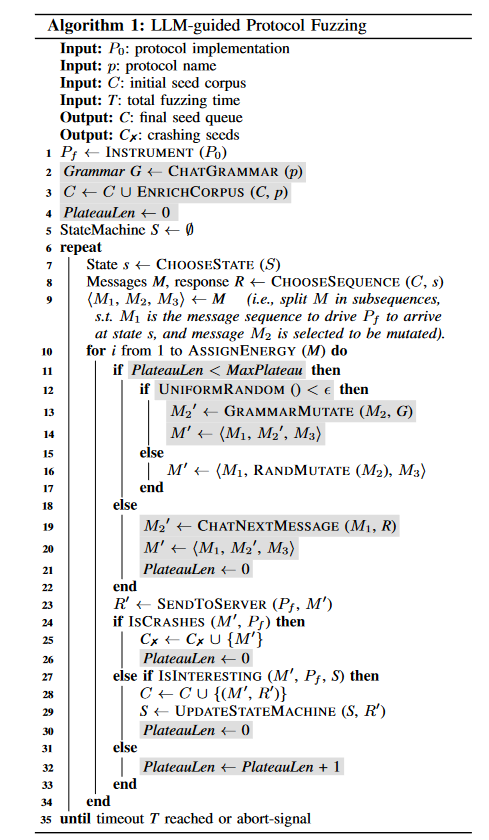

#### A、语法指导变异

该节介绍从LLM中提取语法，并利用语法来指导结构变异。主要挑战是LLM生成的响应具有灵活的自然语言结构，模糊器无法直接理解，需要**统一LLM的响应格式**或者~~手动转化成所需格式~~。

##### 1、提取语法

LLM可以通过简单地提供自然语言prompt来执行特定任务，无需额外训练和编码。因此，模糊器投喂prompt给LLM来生成待测协议的消息语法。

作者在prompt工程中采用**上下文中的少样本学习（in-context few-shot learning）**，这是微调模型的有效方法，该方法需要一些输入和输出示例来增强上下文，使得LLM能够识别prompt语法和输出模式。图6是一个提取语法的示例，将可变区域替换为 `<Value>`，使用两个shot来指导LLM正确生成语法。

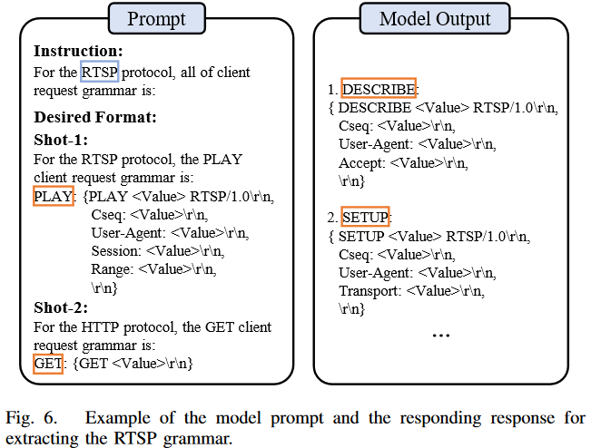

在算法1第二行 `Grammar G <- CHATGRAMMAR(p)`，本文LLMPF与LLM进行对话获得语法并保存在G中，G将用于整个模糊测试的结构化变异，该操作旨在减少与LLM交互的开销。

##### 2、语法变异

LLMPF通过预提取的语法G来指导变异，变异流程如图7所示。LLMPF维护了一个映射格式的语法语料库。首先匹配PLAY语法，使用语法第一行作为消息类型的标签。语法对应具体的消息语法，使用消息类型。LLMPF检索响应语法。随后使用正则表达式将消息中每个头部字段与语法匹配，并将值标记为 `<Value>` 的可变区域，LLMPF仅保存这些字段区域确保消息格式有效。

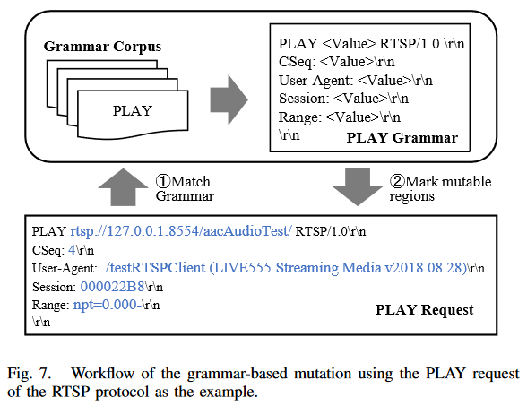

同时也保留了传统变异算法来应对极端情况。

#### B、丰富初始种子集

几个challenges：

1. 如何生成正确上下文信息的新消息？
2. 如何最大限度发挥生成消息的多样性？
3. 如何使LLM从给定种子文件生成整个修改后的消息序列？

对于C1，LLM可以从提供的消息序列中自动学习上下文信息，将profuzzbench的初始种子作为prompt投喂给LLM，以获取上下文信息。

对于C2，模糊器确定初始种子集缺少哪些请求类型，也就是LLM应该生成什么类型的消息来丰富种子集。利用图6中的语法prompt和模型输出信息来维护一组消息类型 `AllTypes = {messageType}`，和语法到类型的一个映射 `G2T = {grammar → type}`。当检测到缺失类型时，利用语法预料库G和G2T来获取现有消息类型集合（Existingtypes），缺少的消息类型在 `MissingType = (AllType - ExistingTypes) ` 中。然后使用LLM生成缺少的类型并插入到初始种子集中。为了避免消息序列过长，在给定消息序列中选择并添加两个缺失类型。

对于C3，为保证消息序列有效性，在后续格式中设计prompt，如**“the modified sequence of client requests is:”** 。图8给出一个示例，指示LLM在给定序列中插入两种类型消息的prompt： `SET PARAMETER` 和 `TEARDOWN`，右侧是修改后的序列。

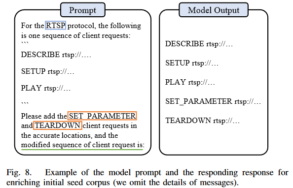

#### C、突破覆盖率瓶颈

现有的协议模糊器很可能无法生成合适的消息序列来覆盖所需的状态转换，会导致很大部分状态空间未被探索。这也是一个比较难解决的问题。当模糊器无法探索新的覆盖范围，称为**覆盖率瓶颈（coverage plateau）**。

本文使用LLM来帮助模糊器突破覆盖率瓶颈，根据模糊器连续生成种子的数量来量化这个持续时间，维护了一个 `PlateauLen` 的全局变量，来记录连续观察到的无趣种子的数量，如算法1第四行所示。若生成测试用例导致crash或者覆盖率变化则将这个变量置0，否则该变量+1。若该变量不超过 `MaxPlateau`（该值由用户指定），LLMPF使用先前介绍的方法来变异，否则认为进入瓶颈。LLMPF将使用LLM来突破瓶颈。如图9所示，为LLM提供历史通信记录，为确保LLM生成真实的消息，作者从初始种子集提取任何消息来说明所需的格式。随后LLM推断当前状态并生成下一个客户端请求M2'，然后插入消息序列M'中发送到服务器。

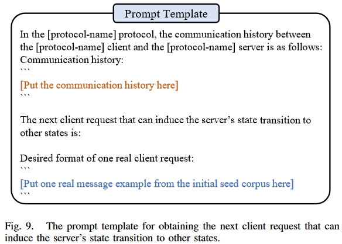

例如：最初RTSP服务器处于 INIT，收到 M1={SETUP} 后转换为 READY。随后模糊器无法生成有趣的种子而陷入瓶颈，之后通过历史记录 H={SETUP, 200-OK} 来刺激LLM，LLM极有可能回复PLAY或者RECORD消息，会引导服务器过渡到不同的状态。

#### D、实现

将算法1添加到AFLNET实现了CHATAFL，实现了以上所述的三种策略。

大模型使用**GPT-3.5 turbo**模型

三种策略为：

- 语法引导变异
- 丰富初始种子集
- 突破覆盖率瓶颈

为了对比消融实验，将CHATAFL拆分为：

- CL0：AFLNET，禁用所有策略
- CL1：AFLNET+语法引导变异
- CL2：AFLNET+语法引导变异+丰富初始种子集
- CL3：CHATAFL=AFLNET+所有策略

### 实验

#### 实验目标：

1. 状态覆盖

2. 代码覆盖

3. 消融实验

4. 新的BUG

#### 实验对象：

基准模糊器：AFLNET、NSFUZZ

待测目标：Live555、ProFTPD、PureFTPD、Kamailio、Exim、forked-daapd

#### 实验设置：

temperature选用0.5来提取语法并丰富种子集，选用1.5来突破覆盖率瓶颈。

在提取语法时，使用五次重复来检查模型生成的一致性。

#### 对比指标：

- 覆盖率
  - 状态覆盖：状态数量，状态转移数量
  - 代码覆盖：
- 漏洞数

### 比较有价值的参考文献

- [22] J. Hu, Q. Zhang, and H. Yin, “Augmenting greybox fuzzing with generative ai,” arXiv preprint arXiv:2306.06782, 2023. （大模型灰盒模糊测试变异）

大模型将自然语言文档和指令翻译可执行代码相关文档：

- Z. Fan, X. Gao, A. Roychoudhury, and S. H. Tan, “Automated repair of programs from large language models,” arXiv preprint arXiv:2205.10583, 2022.
- N. Jain, S. Vaidyanath, A. Iyer, N. Natarajan, S. Parthasarathy, S. Rajamani, and R. Sharma, “Jigsaw: Large language models meet program synthesis,” in Proceedings of the 44th International Conference on Software Engineering, 2022.
- M. Chen, J. Tworek, H. Jun, Q. Yuan, H. P. de Oliveira Pinto, J. Kaplan, H. Edwards, Y. Burda, N. Joseph, G. Brockman, A. Ray, R. Puri, G. Krueger, M. Petrov, H. Khlaaf, G. Sastry, P. Mishkin, B. Chan, S. Gray, N. Ryder, M. Pavlov, A. Power, L. Kaiser, M. Bavarian, C. Winter, P. Tillet, F. P. Such, D. Cummings, M. Plappert, F. Chantzis, E. Barnes, A. Herbert-Voss, W. H. Guss, A. Nichol, A. Paino, N. Tezak, J. Tang, I. Babuschkin, S. Balaji, S. Jain, W. Saunders, C. Hesse, A. N. Carr, J. Leike, J. Achiam, V. Misra, E. Morikawa, A. Radford, M. Knight, M. Brundage, M. Murati, K. Mayer, P. Welinder, B. McGrew, D. Amodei, S. McCandlish, I. Sutskever, and W. Zaremba, “Evaluating large language models trained on code,” 2021.

prompt工程相关文章：

- [10] T. Brown, B. Mann, N. Ryder, M. Subbiah, J. D. Kaplan, P. Dhariwal, A. Neelakantan, P. Shyam, G. Sastry, A. Askell et al., “Language models are few-shot learners,” Advances in neural information processing systems, vol. 33, pp. 1877–1901, 2020.

- [44] X. Wang, J. Wei, D. Schuurmans, Q. Le, E. Chi, S. Narang, A. Chowdhery, and D. Zhou, “Self-consistency improves chain of thought reasoning in language models,” in Proceedings of the 11th International Conference on Learning Representations, 2023.

- [45] J. Wei, X. Wang, D. Schuurmans, M. Bosma, E. Chi, Q. Le, and D. Zhou, “Chain of thought prompting elicits reasoning in large language models,” arXiv preprint arXiv:2201.11903, 2022.

# CHATAFL源码笔记

新使用了cjson、pcre2、kvec库文件进行实现。

新增两个文件：`chat-llm.h` 和 `chat-llm.c`，用于添加的函数实现。

aflnet.c 新增函数 `save_responses_to_file`、`get_responses_from_file`，分别用于保存当前测试用例的响应buf和从文件中读取测试用例的响应内容。

### fuzz流程修改如下：

- main函数初始化阶段添加了两个函数`setup_llm_grammars`和`enrich_testcases`，分别用于设置语法和丰富初始种子集合。`enrich_testcases`该函数会根据设置的语法格式为每个初始种子进行填充，每个种子新增的种子达到满足所有语法为止（如live555，每个种子扩充27个）。
- fuzz_one中添加了一段用于克服瓶颈覆盖率的代码，当uninteresting_times的次数大于预设并且chat_times小于阈值时启动，将当前种子的responses投喂到LLM，期望响应下一个有效消息。这一步是在变异之前进行的。
  - 将uninteresting_times置0，从先前保存的文件中读取种子的响应内容。
  - chat_times++，使用迭代器it_pref开始遍历该种子的消息链kl_messages（it_pref != M2_prev）。
    - 对消息链内M2之前的每个消息创建一个字符串json对象，然后strdup将字符串内容存到request指针指向的内存中，并保证request中所有字符是可打印的。
    - 对第一个消息做城example。
    - 然后将相应内容存在response指针指向内存中，同样确保所有字符可打印。
    - 然后将request和对应response的内容一一存到history指针指向的内存中。
  - 将history中的内容做简化，确保不超过prompt长度最大值。同样对example中内容也做简化。简化算法采用去头法，只保留最大长度的后半段。
  - 将history和example作为参数调用`construct_prompt_stall`构造stall_prompt。
  - 用stall_prompt作为参数调用`chat_with_llm`，尝试次数为2。相应的request和response都存在stall-interactions文件夹中。
  - `extract_stalled_message`提取stall_message，并格式化
  - stall_message作为测试用例进行common_fuzz_stuff，根据返回值来做对应处理，返回1则更新一些操作，0则继续fuzz_one后续流程。
- fuzz_one中havoc阶段使用探索和利用来确定使用随机变异还是语法变异。探索和利用的概率为1：1。
  - 使用了一个结构体`range`来描述变异范围，探索阶段设置`range v = {.len = temp_len, .start = 0, .mutable = 1};`进行随机变异；利用阶段使用`parse_buffer`对outbuf进行语法解析。
  - 然后分配ranges来存储需要分析到的若干个变异范围，进入havoc主for循环。
  - 选定use_stacking，ranges中随机选取一个变异范围，进行usr_stacking轮变异后进行common_fuzz_stuf执行测试用例。HAVOC内的常规变异全都改成为基于ranges的变异。
  - region级别变异也做了有关ranges的修改，case 17 ... 18：替换region并更新ranges做后续变异；case 19 ... 20：把一个region插入当前region前，outbuf变为两个region的结合；case 23 ... 24：将选取到的range_choice在后边重复。

## 函数详解

### 创新点1——语法指导变异

#### setup_llm_grammar

该函数构造prompt与LLM交互，获取语法模板。之后从语法模板中提取正则匹配模式。

- `construct_prompt_for_templates`构造第一次协议模板查询prompt，进入5次循环

  - `chat_with_llm`发送prompt，保存置templates_answer

  - 构造剩余语法查询

  - 拼接两次查询结果，并存到文件中 llm-grammar-output-iter

  - `extract_message_grammars`从拼接的模板中提取语法置`grammar_list`

  - 循环遍历grammar_list，将语法全部存到`const_table`中，格式为 `header:filed[]`

    - 根据迭代器，从list中获取对应值，提取头部字符串存到哈希表`const_table`中，若键不存在则创建一个field_table哈希表作为值
    - 之后将对应非头部字段存到`field_table`中
    - 释放多余对象

- 然后遍历`const_table`

  - 首先创建正则表达式patterns，然后提取const_table中的field_table相应的字符串

  - 创建文件`/protocol-grammars/pattern-%d`

  - 调用`extract_message_pattern`提取正则匹配模式，存到文件`pattern-%d`中：

    ```
    ^(?:TEARDOWN (.*)\r\n)
    (?|(?:Session: (.*)\r\n)|(?:CSeq: (.*)\r\n)|(?:User-Agent: (.*)\r\n)|(?:\r\n))
    ```

  - 最终将所有匹配模式存到`protocol_patterns`

  - 释放有关资源。

#### fuzz_one语法指导变异算法

使用提取的语法来进行结构感知的变异，具体做法是使用提取的正则表达式来匹配语法，确定需要变异的内容范围。havoc中所有变异算法都修改成了基于range的变异，只变异语法指定的range范围内的内容，别的内容保持不变。

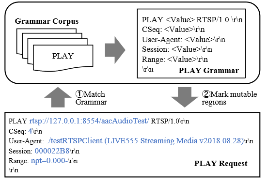

- 50%的概况分别进行havoc_explore和havoc_exploit阶段。
- range是新增定义的一个结构体，包含start、len、mutable三个成员变量。havoc_explore阶段将range设为M2的开头和结尾，也就是对整个M2做AFLNET随机变异；havoc_exploit阶段则调用`parse_buffer`对M2进行语法分析来设定需要变异的range。`parse_buffer`会解析M2中的每个region的range，以列表的形式返回每个region需要变异的范围。
- 之后正式进入havoc的for循环阶段，对range区域进行变异。
  - 进入use_stacking阶段
    - 随机选择一个range，再随机选择一个变异算法进行结构化变异
  - 调用common_fuzz_stuff进行本次fuzzing。

#### parse_buffer

range_list parse_buffer(char *buf, size_t buf_len)

- 遍历先前提取的所有语法正则匹配pattern文件
- 调用`starts_with`使用当前的header_pattern匹配outbuf的header部分，结果保存到header_groups，若header_groups为空，进行下一个pattern文件
- 出栈header_groups最后一个range，也就是整个header的range。调用`get_mutable_ranges`使用fields_pattern匹配

### 创新点2——丰富种子集合

#### get_seeds_with_messsage_types

void get_seeds_with_messsage_types(const char *in_dir, khash_t(strSet) * message_types_set)、

- 创捷一个dirent结构体指针，扫描`in_dir`中的种子文件
- 复制一份消息类型集合messages
- 循环遍历每一个种子文件
  - 将文件读到内存中
  - 使用AFLNET原来的`extract_requests`函数提取regeion，并识别每个region的消息类型
  - 将已有的消息类型从massage集合中剔除，剩下的就是需要补充的消息类型。
  - 最大消息类型数量是10，超过这个阈值则随机剔除一些类型。
  - 调用`message_combinations`构造消息子集，递归将所有类型字符串组合放到message_subsets中。
  - 循环遍历消息子集message_subsets
    - 调用`enrich_sequence`用当前的子集构建prompt向LLM查询来丰富种子集合。
    - 调用`unescape_string`替换查询响应中的转移字符。
    - 调用`format_string`去除原文件和查询响应的前后空字符，对比两者是否相同，跳过生成相同的种子。
    - 调用format_request_message来格式化查询响应。
    - 将查询响应写入新的种子文件。

#### enrich_testcases

- 输出提示信息

- 调用get_seeds_with_messsage_types(in_dir, message_types_set)，这一步会将种子保存到in_dir中，扩充的数量还是挺多的，只有框起来的部分是初始种子。

  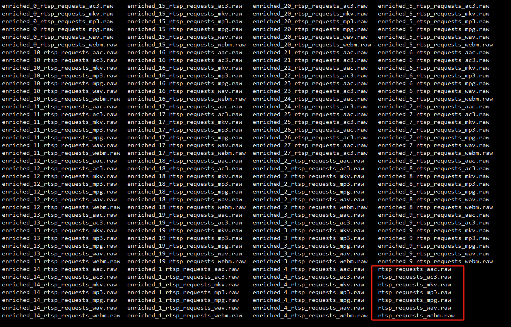

### 创新点3——突破覆盖率瓶颈

#### fuzz_one

选取完M2之后新增了突破覆盖率限制的代码，具体如下：

- uninteresting_times大于设定的阈值（512）并且chat_times要小于阈值（64）则进入突破覆盖率瓶颈模式

- 将uninteresting_times清零，读取当前种子的响应结果responses_temp

- 若responses_temp不为空开始与LLM交互

- 循环遍历消息队列直到M2_prev

  - 提取requset内容，格式化内容，确保所有字符可打印
  - 提取对应的response内容，格式化内容，确保所有字符可打印
  - 若是第一个消息，构造example prompt；否则使用history变量通过realloc构造历史通信记录。

- 修剪history和example的长度，确保不超过定义的长度，超出长度就保留后段部分

- 调用construct_prompt_stall构造stall_prompt，以下是真实情况下构造的一个stall_prompt

  ```
  [{"role": "system", "content": "You are a helpful assistant."}, {"role": "user", "content": "In the RTSP protocol, the communication history between the RTSP client and the RTSP server is as follows.The next proper client request that can affect the server's state are:
  
  Desired format of real client requests:
  Request-1:
  DESCRIBE rtsp://127.0.0.1:8554/aacAudioTest RTSP/1.0
  CSeq: 2
  User-Agent: ./testRTSPClient (LIVE555 Streaming Media v2018.08.28)
  Accept: application/sdp
  
  
  Request-2:
  DESCRIBE rtsp://127.0.0.1:8554/aacAudioTest RTSP/1.0
  CSeq: 2
  User-Agent: ./testRTSPClient (LIVE555 Streaming Media v2018.08.28)
  Accept: application/sdp
  
  
  Communication History:
  """
  ack1 RTSP/1.0
  CSeq: 4
  User-Agent: ./testRTSPClient (LIVE555 Streaming Media v2018.08.28)
  Transport: RTP/AVP;unicast;client_port=50778-50779
  
  RTSP/1.0 201 OK
  CSeq: 4
  Date: Mon, Oct 30 2023 06:05:30 GMT
  Transport: RTP/AVP;unicast;destination=127.0.0.1;source=127.0.0.1;client_port=50778-50779;server_port=6970-6971
  Session: 000022B8;timeout=65
  
  TEARDOWN rtsp://127.0.0.1:8554/wavAudioTest/ RTSP/1.0
  CSeq: 7
  User-Agent: ./testRTSPClient (LIVE555 Streaming Media v2018.08.28)
  Session: 000022B8
  
  RTSP/1.0 404 Stream Not Found
  CSeq: 7
  Date: Mon, Oct 30 2023 06:05:30 GMT
  
  SETUP rt\u0000\u0010:/7K27H0.0.1:8\u0000\u00014/mp3AudioSP/1.0
  CSeq: /
  User-Agent: ./testRTSPCSET_PARAMETERli (LIVE555 St eam.28)./testRTSPCSET_PARAMETERli (LIVE555 St eam.28)
  Transport: RTP/AVP;webmFileTestnt_p43713
  
  RTSP/1.0 400 Bad Request
  Date: Mon, Oct 30 2023 06:05:30 GMT
  Allow: OPTIONS, DESCRIBE, SETUP, TEARDOWN, PLAY, PAUSE, GET_PARAMETER, SET_PARAMETER
  
  GET_PARAMETER rtsp://127.0.0.1:8554/aacAudioTest/ RTSP/1.0
  CSeq: 3
  User-Agent: ./testRTSPClient (LIVE555 Streaming Media v2018.08.28)
  Session: 000022B8
  
  RTSP/1.0 404 Stream Not Found
  CSeq: 3
  Date: Mon, Oct 30 2023 06:05:30 GMT
  
  """"}]
  ```

- 调用chat_with_llm进行交互，交互结果存于stall_response

- 调用extract_stalled_message、format_request_message提取并格式化LLM返回的下一步需要发送的stall_message

- 使用stall_message作为M2进行common_fuzz_stuff。

- 覆盖率瓶颈突破阶段到此结束。后续是正常的fuzz_one流程。

### LLM交互相关函数

#### chat_with_llm

char *chat_with_llm(char *prompt, char *model, int tries, float temperature) 

该函数主要用于将prompt发送到LLM并接收LLM响应。

- 首先判断model，根据选择chat模型还是completions模型来设定url，构造auth、content、accept等头部字段，使用json作为收发格式。构造data数据如下：

  ```json
  {
      "model": "text-davinci-003"或"gpt-3.5-turbo",
      "prompt": "prompt", 
      "max_tokens": MAX_TOKENS, 
      "temperature": temperature
  }
  ```

- `curl_easy_perform`发送构造好的http请求，回调函数是`chat_with_llm_helper`，缓冲区是`chunk`。

- 若请求成功，解析chunk的内容，存到answer中，否则sleep 2秒恢复服务。

- 释放资源。

#### chat_with_llm_helper

static size_t chat_with_llm_helper(void *contents, size_t size, size_t nmemb, void *userp)

该函数为curl的回调函数，使用realloc来动态分配存储LLM响应的缓冲区，返回新缓冲区的大小。

### prompt工程相关

#### construct_prompt_for_templates

char *construct_prompt_for_templates(char *protocol_name, char **final_msg)

构造相关协议的prompt模板，

- 设置一个学习示例让LLM学习格式，称为上下文小样本学习（in-context few-shot learning），使LLM能返回所需要的格式。

  ```c
  char *prompt_rtsp_example =
  	"For the RTSP protocol, the DESCRIBE client request template is:\\n"
  	"DESCRIBE: [\\\"DESCRIBE <<VALUE>>\\\\r\\\\n\\\","
  	"\\\"CSeq: <<VALUE>>\\\\r\\\\n\\\","
  	"\\\"User-Agent: <<VALUE>>\\\\r\\\\n\\\","
  	"\\\"Accept: <<VALUE>>\\\\r\\\\n\\\","
  	"\\\"\\\\r\\\\n\\\"]";
  char *prompt_http_example = 
      "For the HTTP protocol, the GET client request template is:\\n"
      "GET: [\\\"GET <<VALUE>>\\\\r\\\\n\\\"]";
  ```

- 创建msg(prompt)

  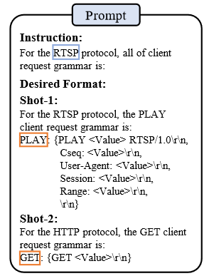

- 将msg保存置prompt_grammars并返回，prompt_grammars如下所示，将msg添加了role和content。

  ```json
  [	
   {
      "role": "system", 
      "content": "You are a helpful assistant."
   }, 
   {
       "role": "user", 
       "content": "For the RTSP protocol, the DESCRIBE client request template is:\nDESCRIBE: [\"DESCRIBE <<VALUE>>\\r\\n\",\"CSeq: <<VALUE>>\\r\\n\",\"User-Agent: <<VALUE>>\\r\\n\",\"Accept: <<VALUE>>\\r\\n\",\"\\r\\n\"]\nFor the HTTP protocol, the GET client request template is:\nGET: [\"GET <<VALUE>>\\r\\n\"]\nFor the RTSP protocol, all of client request templates are :"
   }
  ]
  ```

#### construct_prompt_for_remaining_templates

char *construct_prompt_for_remaining_templates(char *protocol_name, char *first_question, char *first_answer)

`construct_prompt_for_templates`的返回值投喂到LLM得到的结果作为该函数的first_answer，msg作为first_question。由于LLM能对 "all" 这个词不敏感，导致生成的语法不全，使用这个函数来进行补充剩余的语法。

- 构造second_question

  ```
  "For the RTSP protocol, other templates of client requests are:"
  ```

- 使用first_question、second_question构造prompt返回。

#### extract_message_grammars

void extract_message_grammars(char *answers, klist_t(gram) * grammar_list)

- 遍历answers
- 每次匹配answers中最近的 '[' 和 ']' 作为本次的开头和结尾
- 提取中间部分存在temp中，末尾添 '\0'
- 将temp添加到grammar_list中

#### extract_message_pattern

char *extract_message_pattern(const char *header_str, khash_t(field_table) * field_table, pcre2_code **patterns, int debug_file, const char *debug_file_name)

该函数将两条正则匹配式存到正则匹配数组中，第一个是匹配头，第二个匹配字段；若失败则NULL。

- 编译一条正则表达式 `replacer = "(?:(.*)(?:<<(.*)>>)(.*))|(.+)"`，并创建匹配对象`match_data`。该式子用于匹配`"OPTIONS <<VALUE>>\r\n"`这类型的式子。
- 遍历header_str，跳过 `'\0', ' ', '\n', '\r', '\\'`等字符，获取消息类型存到`message_type`
- 构造`header_pattern`，使用到了`parse_pattern`
- 循环遍历`field_table`来构造`fields_pattern`，用'|'作为每个字段模式的分割符，也使用到了`parse_pattern`

  ```
  patterns[0] = (?:PLAY (.*)\r\n)
  patterns[1] = (?|(?:CSeq: (.*)\r\n)|(?:User-Agent: (.*)\r\n)|(?:Range: (.*)\r\n)|(?:\r\n))
  ```

- 分别header和fields的编译正则表达式，存到patterns[0]和patterns[1]

- 返回消息类型，header的字段名作为消息类型，如OPTIONS、PLAY等

